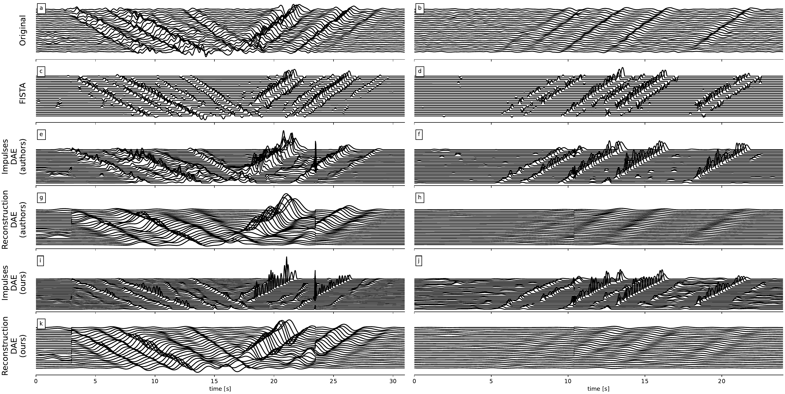

# DeepDeconv

**Deep learning based deconvolution algorithm implemented with a U-Net.**

## Index

- [DeepDeconv](#deepdeconv)
  - [Index](#index)
  - [Goal](#goal)
  - [Results](#results)
  - [Training Data](#training-data)
  - [Installation](#installation)
    - [Generate a virtualenv (Windows):](#generate-a-virtualenv-windows)
    - [Install Requierements:](#install-requierements)
    - [Test model](#test-model)
    - [Train the model](#train-the-model)

## Goal

Distributed Acoustic Sensing (DAS) is a method that allows the use of an optical fibre as an array of discrete sensors. Its implementation in already placed optical fibres for telecommunications can be useful for monitoring vibrations in structures and detection of earthquakes, among other things. In this work, a particular application is studied where an optical fibre is placed below a highway, and it is used for estimating the velocity of vehicles. A so called Deconvolutional Autoencoder is used to process the measured signals for a better estimation of the vehicles’ velocity. 


**In this project**, the Deconvolutional Autoencoder is retrained with the data consisting on the vibrations caused by vehicles on a highway to compare the results given in the original work. This implementation is compared with a classic minimisation algorithm for deconvolution called FISTA. Once the Deconvolutional Autoencoder is trained with the original data, it is adapted to new data by changing the activaction function of the output layer and the convolution method used for feedback. **This is done as a proof-of-concept, to test if is possible to use the DAE to process data measure on a fiber from a linear frequency chirp, in order to sense the characteristics of a certain terrain.**

The DAE is based on the work of
```
@article{van2022deep,
  title={Deep Deconvolution for Traffic Analysis with Distributed Acoustic Sensing Data},
  author={van den Ende, Martijn and Ferrari, Andr{\'e} and Sladen, Anthony and Richard, C{\'e}dric},
  journal={IEEE Transactions on Intelligent Transportation Systems},
  year={2022},
  publisher={IEEE}
}
```

A comprehensive explaination of the work done can be found on the full-report: [_IPD440____Estado_Final](_IPD440____Estado_Final.pdf)

## Results


When applying the DAE to the new data we could observe that the architecture used by the authors of the network performs a cross-decorrelation instead of a deconvolution, by not inverting the kernel in the feedback. This error is due to the fact that machine learning libraries often use interchangeably the term convolution applied to cross-correlation and convolution. By using the correct kernel inversion, an improvement in convergence is obtained. convergence improvement is obtained.


## Training Data

The training data can be download from the following site:
```
https://figshare.com/articles/software/Deep_Deconvolution_for_Traffic_Analysis_with_Distributed_Acoustic_Sensing_Data/16653163
```

## Installation 

### Generate a virtualenv (Windows):

1. Install virtualenv
```
pip install virtualenv
```

2. Create environment
```
virtualenv DeepDeconv
```
3. Activate environment
```
DeepDeconv\Scripts\activate
```

### Install Requierements: 

```
pip install -r requirements.txt
```

### Test model 

Testing the model:

```
python test.py --weights "/weights/best.ckpt"
```

### Train the model 
Training the model:
```
python train.py --epochs 1000
```

In case "cannot be loaded because running scripts is disabled on this system":
```
Set-ExecutionPolicy Unrestricted -Scope Process
```